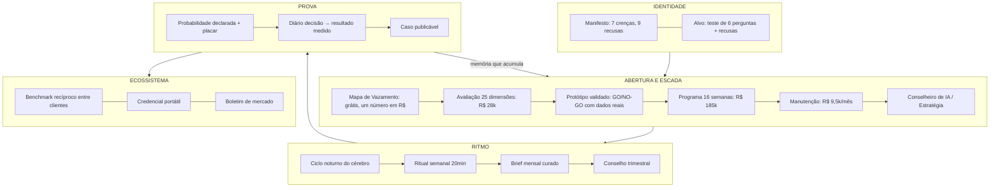

# O Mapa da ABBA: a empresa inteira em uma página

> **Camada:** identidade. A vista de cima que responde "o que a ABBA é AGORA?" sem abrir outro arquivo. Origem: pedido do sócio (2026-08-01) de visualizar a empresa como um todo depois da rodada de mudanças. **Atualizar a cada decisão V-registrada que mude o estado de uma peça**: um mapa desatualizado é pior que mapa nenhum.
>
> Legenda de estado: ✅ vivo · 🔒 construído e gateado (com o gatilho nomeado) · 📋 especificado, não construído · ⬜ aguardando decisão de sócios.

---

## A proposta, em uma frase

> **Instalamos capacidade de IA e provamos o que ela mudou (número combinado antes, medido depois, assinado por gente) com uma memória por cliente que fica mais valiosa a cada mês e um radar que avisa antes de virar problema.**

A aposta estratégica por trás: virar **a régua, o cartório e o radar** da adoção de IA na média empresa brasileira (R$ 50–500 mi). Régua = benchmark; cartório = diário decisão→resultado; radar = a camada de antecipação. Fundamentos em [Visão 2029](visao-2029.md), [estudo de antecipação](../05-interno/estudo-antecipacao.md) e [ecossistema](ecossistema.md).

**A prateleira (V3c):** a primeira frase em qualquer mesa diz **o que não dá para fazer de dentro**: construção em escala + prova de terceiro. Nunca "mais uma consultoria de IA", nunca disputa com o diretor de IA do cliente, e nunca a categoria "auditoria": a analogia pode; a categoria criaria conflito com construir e treinar (regra completa no [posicionamento](posicionamento.md)).

## O organismo

## O estado real de cada peça

| Peça | Estado | Onde | Gatilho (quando gateado) |
|---|---|---|---|
| Manifesto, posicionamento, kit de presença | ✅ | [manifesto](manifesto.md) · [kit](../03-comercial/kit-de-presenca.md) |  |
| Alvo por forma + critérios de recusa | ✅ (faixa de faturamento é ⬜ proposta) | [alvo](alvo.md) | Sócios confirmam R$ 50–500 mi |
| Mapa de Vazamento (peça de abertura) | ✅ | [processo](../03-comercial/mapa-de-vazamento.md) + seção 1 do modelo DOCX |  |
| Deck institucional (13 slides, posicionamento vigente) | ✅ regenerado 2026-08-01 | [modelo PPTX](../08-materiais/modelos/abba-deck-institucional.pptx) · roteiro no [kit](../03-comercial/kit-de-presenca.md) |  |
| Escada com preços v1 | ✅ travada | [escada](../03-comercial/escada-abba.md) · [tabela](../03-comercial/tabela-de-precos.md) | v2 = ⬜ após 3 reações reais de preço |
| Protocolo de prova + caso publicável | ✅ | [protocolo](../04-entrega/protocolo-de-prova.md) · [molde](../05-interno/caso-publicavel-modelo.md) | Primeiro caso = 1º cliente real |
| Ritual semanal de 20 min | ✅ processo (camadas Evolução+) | [ritual](../04-entrega/ritual-semanal.md) | Começa no 1º cliente de manutenção |
| Pré-mortem + indicadores antecedentes no kickoff | ✅ | [kickoff](../04-entrega/kickoff-roteiro.md) |  |
| **Cérebro (Conselheiro Digital)**: memória bitemporal, ciclo noturno, diário, auditoria, playbooks, antecipação | ✅ em código (**429/429**, 6 rodadas adversariais, migrações 029–047) · 🔒 em produção | [dossiê vivo](../04-entrega/dossie-vivo-conselheiro-digital.md) · [runbook](../06-ferramentas/runbook-ativacao.md) | Validação com LLM real + golden set + cron ligado + Cliente Zero (runbook §6) |
| Gatilho por decisão + probabilidade declarada + fila da manhã (`brain next`) | ✅ em código | idem | idem |
| Placar de calibração por engajamento | ✅ em código | `abba brain calibration` | Piso de 20 decisões medidas; **placar da firma: 🔒 10+ clientes** |
| Avaliação 25 dimensões | ✅ ferramenta · ⚠️ validada só em sintético | [ferramenta](../06-ferramentas/ferramenta-avaliacao.md) | R1: 1º cliente charter é a 1ª validação real |
| Portal de capacitação (trilhas, Bússola, Iris, durabilidade) | ✅ completo por desenho sem vídeo (27 aulas em 4 blocos); vídeos por gravar | [ferramenta](../06-ferramentas/ferramenta-portal.md) | Gravação pelos fundadores em lotes (14/27 roteiros prontos): **sem data prometida a cliente** |
| Benchmark entre clientes (fluência + durabilidade) | 🔒 construído, invisível ao cliente | [ecossistema](ecossistema.md) §3 | 5 clientes qualificados (≥5 pessoas cada) |
| Credencial verificável portátil | ✅ funcional | portal `/verify` | Combinável já na 1ª graduação |
| Rede de campeões entre clientes | 🔒 plano em 3 estágios | [ecossistema](ecossistema.md) §4 | 3 clientes com campeões |
| Anexo IV do contrato (contribuição anonimizada + rede) | ⬜ minutado, **caminho crítico** | [contrato](../03-comercial/contrato-sow-esqueleto.md) | **P4b: advogado: antes de QUALQUER assinatura** |
| Cofre de padrões entre engajamentos | ✅ mecânica · vazio | assessment-brain vault | Enche com engajamentos reais |
| O Radar (varredura regulatória/sinal fraco) | 📋 aposta 6 | [apostas](apostas-futuras.md) | 1º cliente pagante + provedor de busca + custo medido |
| Caça ao Dinheiro · Resgate de IA | 📋 candidatas | [estudo financeiro](../05-interno/estudo-ia-financeira.md) · [plano](../05-interno/plano-implementacao-conselheiro.md) §12 | Pauta de sócios |
| Recomendador loop-native · framework v2 (D26–D28) | 🔒 | assessment-brain | Validação com LLM real (runbook §6) |
| Prateleira nova: camada independente de prova (1ª frase de tudo) | ✅ V3c | [posicionamento](posicionamento.md) "A prateleira" |  |
| Defesa "já temos diretor de IA" (discurso + fundamento) | ✅ | [objeção](../03-comercial/objecao-diretor-de-ia.md) · [estudo](../05-interno/estudo-imunidade-diretor-de-ia.md) | Registrar reação real nas 3 primeiras mesas |
| Prontidão regulatória ISO 42001 + PL 2338 na avaliação | ✅ manual (mapa + 10 perguntas) | [mapa](../06-ferramentas/mapa-avaliacao-iso42001-pl2338.md) | Texto ABNT p/ conferência · sanção do PL |
| Parecer do conselho consultivo (7 lentes) | ✅ entregue | [parecer](../05-interno/parecer-conselho-2026-08.md) | ⬜ Sócios: pauta da reunião |
| "O Assento": Conselheiro presente (reuniões, voz, integrações) | 📋 desenhado em 5 camadas · **só a camada 0 é vendável hoje** | [estudo](../05-interno/estudo-conselheiro-presente.md) | Onda 1 = ABBA usa em si (30 dias) → anexo de captura no advogado (P4) |
| **Conselheiro Vertical**: Revisor de doutrina + instância ABBA + ponte portal→cérebro + outside view no vault | ✅ em código (443/443, migração 048) · V3g | [plano §14](../05-interno/plano-implementacao-conselheiro.md) · [régua](../06-ferramentas/regua-do-revisor.md) · [runbook](../05-interno/abba-interna-runbook.md) | ⬜ Sócios: rodar a instância ABBA 4 semanas · 🔒 injeção memória→análise (eval) · 🔒 voz visível (3+ clientes) |

## O que é só de vocês (ninguém mais destrava)

> **Execução guiada:** cada item abaixo está transformado em tarefa executável (texto pronto, comandos, pauta) no [kit de execução dos sócios](../05-interno/kit-de-execucao-socios.md).

| # | Pendência | Por que importa | Onde |
|---|---|---|---|
| 1 | **P4 + P4b: advogado** (contrato + Anexo IV + licença 4D) | **Porta de uma via**: cliente assinado sem o Anexo IV fica fora do ecossistema para sempre | [riscos R2, R15, R22](../05-interno/registro-de-riscos.md) |
| 2 | **R23: Pedro verifica o cron do portal** | Código diz desligado, config diz ligado: não prometer cadência sem saber a verdade | [riscos](../05-interno/registro-de-riscos.md) |
| 3 | Faixa de faturamento do alvo (proposta: R$ 50–500 mi) | Trava o teste de qualificação | [alvo](alvo.md) |
| 4 | Preço v2 (com ritual semanal e Conselheiro dentro) | A semanal entrou nas camadas sem preço decidido | [tabela](../03-comercial/tabela-de-precos.md) |
| 5 | P3 (nome do programa) · P5 (contador) | Bloqueiam site e 1ª nota fiscal | [registro](../05-interno/registro-de-decisoes.md) |
| 6 | R16: código do assessment web para o repo | A prova comercial mais citada existe só no deploy do Pedro | [riscos](../05-interno/registro-de-riscos.md) |

## Os números que resumem o momento

**429** testes verdes nos dois modos · **7** rodadas de revisão adversarial independente (**137** defeitos achados e corrigidos antes de qualquer cliente) + o **conselho de 7 lentes** · **0** links quebrados em ~920 · **0** clientes reais, e é exatamente por isso que a ordem é: fechar P4b → ensaiar o Cliente Zero → prospectar com os 4 artefatos ([plano de ação](../05-interno/plano-de-acao.md)).

## O que o conselho consultivo disse (2026-08)

Sete conselheiros-agentes independentes analisaram a empresa inteira por lentes adversariais (dono, CFO, CTO, concorrente, investidor, DPO, vendedor). Placar: **3 sim-com-ressalvas · 3 talvez · 1 não**: o único "não" é ao modelo como investimento, não à oferta. A frase-síntese: *"parem de escrever a firma e comecem a vendê-la, mas não assinem nada antes do advogado"*. Parecer completo, gargalos ranqueados e plano de 60 dias: [parecer do conselho](../05-interno/parecer-conselho-2026-08.md).
